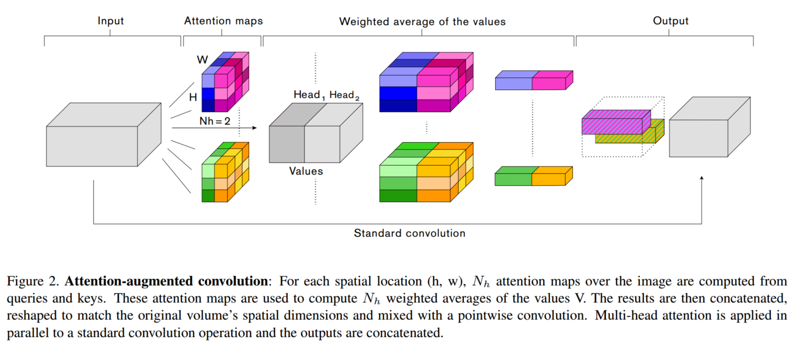
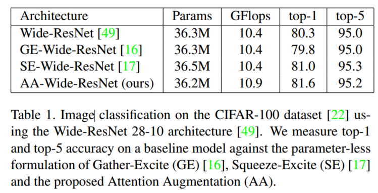

# attention-augmented.pytorch
An unofficial Pytorch Implementation for [Attention Augmented Convolutional Networks
](<https://arxiv.org/abs/1904.09925v1>)

The network structure is as below:

The result in paper is as below:

## Reference
[Attention Augmented Convolutional Networks](https://arxiv.org/abs/1904.09925v1)

[wide-resnet.pytorch](https://github.com/meliketoy/wide-resnet.pytorch)